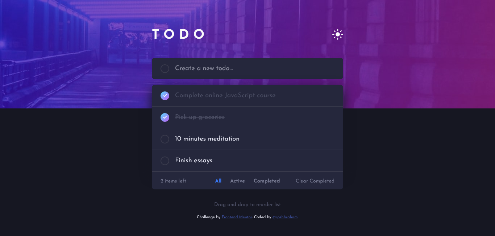

# Frontend Mentor - Todo app solution

This is a solution to the [Todo app challenge on Frontend Mentor](https://www.frontendmentor.io/challenges/todo-app-Su1_KokOW).

### **[Live Site Link]()**

---

## Overview

### The challenge

Users should be able to:

-   View the optimal layout for the app depending on their device's screen size
-   See hover states for all interactive elements on the page
-   Add new todos to the list
-   Mark todos as complete
-   Delete todos from the list
-   Filter by all/active/complete todos
-   Clear all completed todos
-   Toggle light and dark mode
-   **Bonus**: Drag and drop to reorder items on the list

### Screenshot



## My process

### Built with

-   Semantic HTML5 markup
-   CSS custom properties
-   Flexbox
-   Mobile-first workflow
-   [React](https://reactjs.org/) - JS library

### What I learned

**Drag event handling!** I had to look this one up, and ended up coming across **[this very useful tutorial](https://www.youtube.com/watch?v=jfYWwQrtzzY&ab_channel=WebDevSimplified)** from [@WebDevSimplified](https://www.youtube.com/@WebDevSimplified) on YouTube.

My implementation was a little different, though - making use of `elem.closest(<selector>)` and `elem.nextSibling`:

```js
const handleDragOver = (event) => {
	event.preventDefault();
	const y = event.clientY;
	const todoList = todoListRef.current;
	const dragged = todoList.querySelector(".dragging");
	const closest = event.target.closest(".todo");

	if (closest == null) {
		const todoListRect = todoList.getBoundingClientRect();
		if (todoListRect.top > y) {
			todoList.prepend(dragged);
		} else if (todoListRect.bottom < y) {
			todoList.append(dragged);
		} else {
			return;
		}
	} else {
		const closestRect = closest.getBoundingClientRect();
		if (
			closestRect.top > y ||
			(closestRect.top + closestRect.bottom) / y > 2
		) {
			todoList.insertBefore(dragged, closest);
		} else if (
			closestRect.bottom < y ||
			(closestRect.top + closestRect.bottom) / y < 2
		) {
			todoList.insertBefore(dragged, closest.nextSibling);
		}
	}

	if (filter === "all") {
		order.current = [...todoList.querySelectorAll(".todo")].map((todo) =>
			Number(todo.id)
		);
	}
};
```

The last conditional `if (filter === "all")` I used to capture the current order of the todos, so that it if filters were switched around the list would remember it.

### Continued development

I think the drag and drop feature, though functional, is visually lacking. I am aware of a react drag & drop library (beautiful dnd? or something like that) but I chose to code this feature from "scratch" to learn about drag events.

---

## Author

-   Frontend Mentor - [@joshbraham](https://www.frontendmentor.io/profile/joshbraham)
